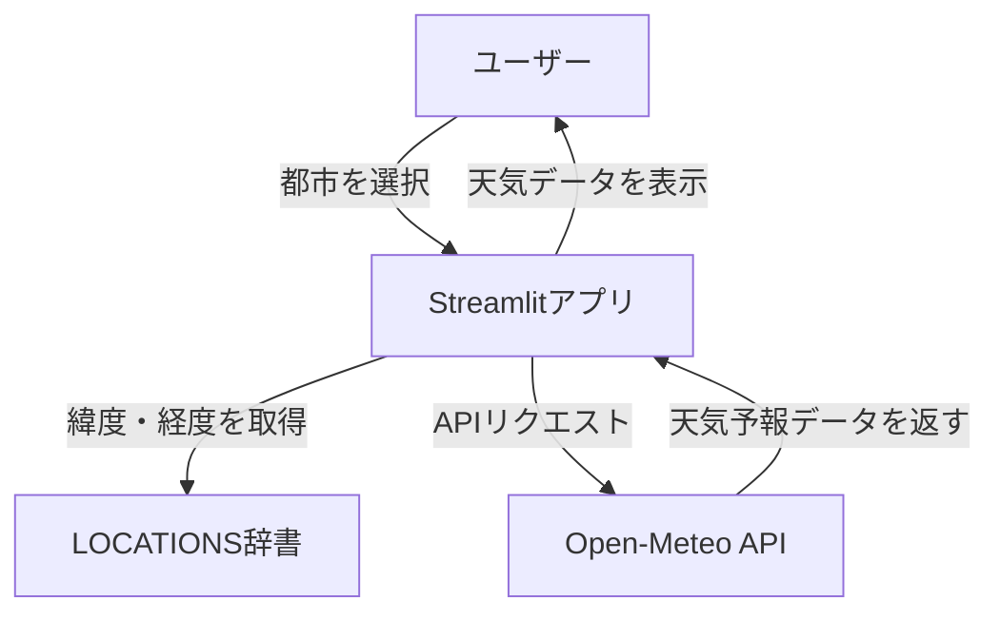
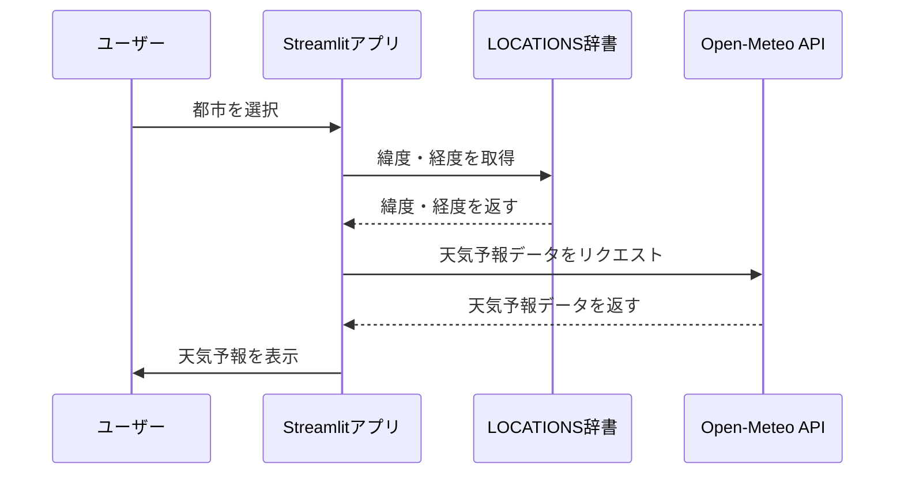

## 概要図

```mermaid
graph TD
    A[ユーザー] -->|都市を選択| B[Streamlitアプリ]
    B -->|緯度・経度を取得| C[LOCATIONS辞書]
    B -->|APIリクエスト| D[Open-Meteo API]
    D -->|天気予報データを返す| B
    B -->|天気データを表示| A
```

## シーケンス図

```mermaid
sequenceDiagram
    participant User as ユーザー
    participant App as Streamlitアプリ
    participant LOC as LOCATIONS辞書
    participant API as Open-Meteo API

    User->>App: 都市を選択
    App->>LOC: 緯度・経度を取得
    LOC-->>App: 緯度・経度を返す
    App->>API: 天気予報データをリクエスト
    API-->>App: 天気予報データを返す
    App->>User: 天気予報を表示
```